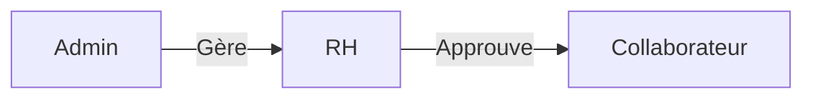

# Cahier des Charges - Portail RH Modulaire

## 1. Introduction  
**Objectif** : Développer une plateforme centralisée pour la gestion des ressources humaines, permettant :  
- Une interaction fluide collaborateurs/RH  
- La digitalisation des processus RH  
- Une gestion sécurisée des données sensibles  
- La génération automatisée de documents  

**Portail** :  
- Public cible : Collaborateurs, Responsables RH, Administrateurs système  
- Modules principaux : Authentification, Gestion des documents, Formations, Messagerie, Notifications  

---

## 2. Exigences Fonctionnelles

### 2.1 Module d'Authentification  
- Connexion sécurisée via JWT  
- Inscription avec validation email
- Réinitialisation MDP par email  
- Hiérarchie des rôles : Admin → RH → Collaborateur  

### 2.2 Gestion des Profils  
**Profil utilisateur** :  
- Informations personnelles  
- Informations professionnelles
- Photo de profil  
- Statut en ligne

### 2.3 Module Documents  
| Type Document      | Workflow                 | 
|--------------------|--------------------------|
| Fiche de paie     | Demande → Validation RH  | 
| Attestation       | Demande → Validation RH  | 
| Certificat        | Demande → Validation RH  | 

### 2.4 Module Formation  
- Demande de formation (interne/externe)
- Validation par RH
- Suivi des demandes
- Notifications automatiques

### 2.5 Communication
- Messagerie instantanée entre utilisateurs
- Système de notifications en temps réel
- Suivi des statuts des demandes

## 3. Exigences Techniques

### 3.1 Stack Technologique  
- **Frontend** : Angular  
- **Backend** : Node.js/Express  
- **Base de données** : MongoDB
- **Temps réel** : Socket.IO  

### 3.2 Sécurité  
- Authentification JWT
- Validation des rôles
- Vérification par email
- Sessions sécurisées

### 3.3 Documentation  
- API documentée avec Swagger
- Documentation technique
- Guide utilisateur

### 3.4 Fonctionnalités Temps Réel
- Notifications instantanées
- Statut de connexion des utilisateurs
- Messagerie en direct
- Mises à jour des statuts des demandes

---

### 2.1 Module d'Authentification  
- Connexion sécurisée via JWT  
- Réinitialisation MDP par email  
- Hiérarchie des rôles : Admin → RH → Collaborateur  
- Gestion des sessions (timeout après 15 min d'inactivité)  

*Critères d'acceptation* :  
- Temps de réponse < 1s pour l'authentification  
- Support multi-facteur (optionnel)  

### 2.2 Gestion des Profils  
**Profil collaborateur** :  
- Informations personnelles + photo  
- Historique professionnel  
- Documents administratifs  

**Profil financier (RH seulement)** :  
- Historique de paie  
- Avantages sociaux  
- Comptes épargne entreprise  

### 2.3 Module Documents  
| Type Document      | Workflow                 | Délai Max |  
|--------------------|--------------------------|-----------|  
| Fiche de paie      | Auto-généré mensuellement | 2h        |  
| Attestation        | Validation RH requise     | 24h       |  
| Certificat         | Signature électronique    | 48h       |  

### 2.4 Gestion des Congés  
- Calcul automatique des soldes  
- Workflow d'approbation visuel  
- Intégration calendrier Google/Microsoft  
- Politiques personnalisables (congés maladie/RTT)  

### 2.5 Tableau de Bord RH  
```json
{
  "formations": {
    "budget_utilisé": "65%",
    "demandes_en_attente": 12
  },
  "congés": {
    "taux_occupation": "78%",
    "solde_moyen": "18j"
  }
}
```

---

## 3. Exigences Techniques

### 3.1 Stack Technologique  
- **Frontend** : React + Redux (SPA responsive)  
- **Backend** : Node.js/Express (API REST)  
- **Base de données** : PostgreSQL + Redis (cache)  
- **Infra** : Docker + Kubernetes (cluster 3 nodes)  

### 3.2 Modèle de Données  
  

### 3.3 Intégrations  
- ERP interne (SAP SuccessFactors)  
- Service de signature électronique (DocuSign)  
- Système de paie (ADP)  

---

## 4. Sécurité  
- **Chiffrement** : AES-256 pour les données au repos  
- **RBAC** (Role-Based Access Control) :  

- Audit trimestriel des logs d'accès  
- Sauvegardes chiffrées quotidiennes (AWS S3)  

---

## 5. Interface Utilisateur  
**Maquettes** :  
- Page d'accueil collaborateur :  
  
- Console RH :  
  

**Principes UX** :  
- Navigation en 3 clics max  
- Contrast ratio AA minimum (WCAG 2.1)  
- Dark mode optionnel  

---

## 6. Déploiement et Infrastructure

### 6.1 Configuration Docker
**Architecture des Conteneurs** :
- Backend (Node.js/Express)
- Base de données (MongoDB)

**Configuration docker-compose.yml** :
```yaml
services:
  app:
    build: 
      context: .
      dockerfile: Dockerfile
    container_name: portal-rh-backend
    ports:
      - "3000:3000"
    environment:
      MONGO_URI: mongodb://mongo:27017/PortalRh
      JWT_SECRET: [SECRET_KEY]
      EMAIL_USER: [EMAIL]
      EMAIL_PASS: [EMAIL_PASSWORD]
      FRONTEND_URL: http://localhost:4200
      COMPANY_NAME: [COMPANY_NAME]
      COMPANY_ADDRESS: [ADDRESS]
      COMPANY_PHONE: [PHONE]
      COMPANY_MAT: [MATRICULE]
      COMPANY_CNSS: [CNSS]
      COMPANY_LOGO_URL: [LOGO_URL]
    volumes:
      - .:/usr/src/app
    depends_on:
      - mongo

  mongo:
    image: mongo:8.0
    container_name: portal-rh-mongodb
    restart: always
    ports:
      - "27017:27017"
    volumes:
      - mongo-data:/data/db
```

### 6.2 Commandes Docker Essentielles
```bash
# Démarrer l'application
docker-compose up -d

# Arrêter l'application
docker-compose down

# Nettoyer et redémarrer (supprime les volumes)
docker-compose down -v && docker-compose up -d

# Voir les logs
docker-compose logs -f

# Reconstruire les conteneurs
docker-compose build
```

### 6.3 Accès aux Services
- API Backend : `http://localhost:3000`
- MongoDB : `mongodb://localhost:27017`
- MongoDB Compass : `mongodb://localhost:27017`

### 6.4 Bonnes Pratiques de Développement
- Utiliser `docker-compose down -v` lors du changement de branches
- Surveiller les logs avec `docker-compose logs -f`
- Les données MongoDB sont persistantes via le volume `mongo-data`
- Le code source est monté en volume pour le développement

### 6.5 Sécurité
- MongoDB accessible uniquement dans le réseau Docker
- Gestion des secrets via variables d'environnement
- Authentification JWT configurée
- Credentials email sécurisés

### 6.6 Déploiement en Production
- Gestion des secrets appropriée
- Configuration de l'authentification MongoDB
- Stratégie de backup pour le volume MongoDB
- Configuration des logs et monitoring
- Sécurité réseau appropriée

---

